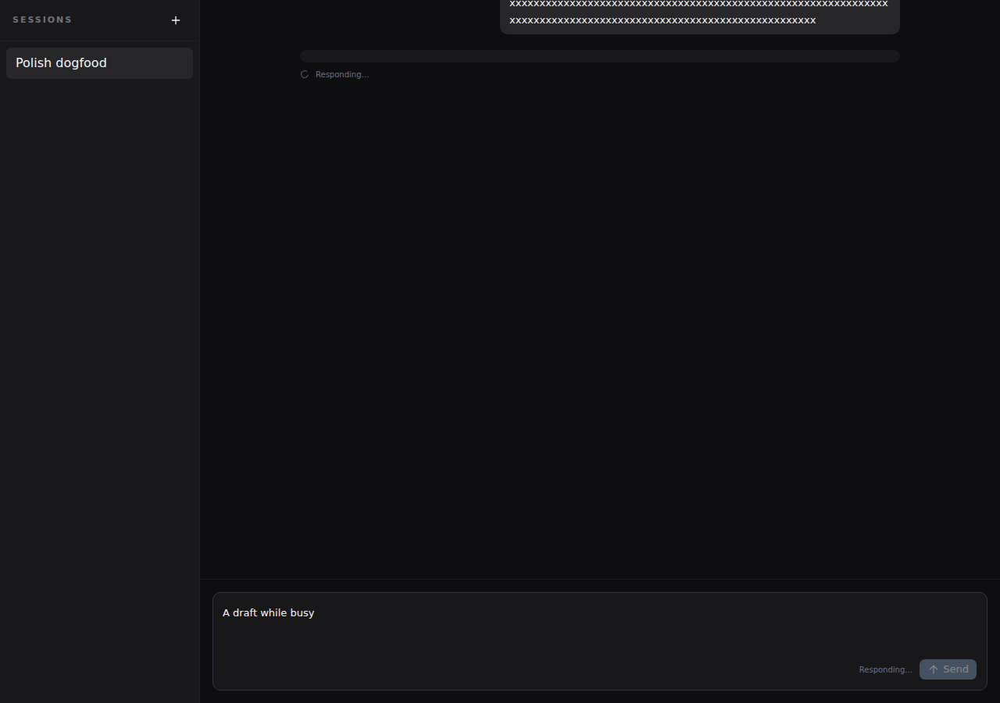
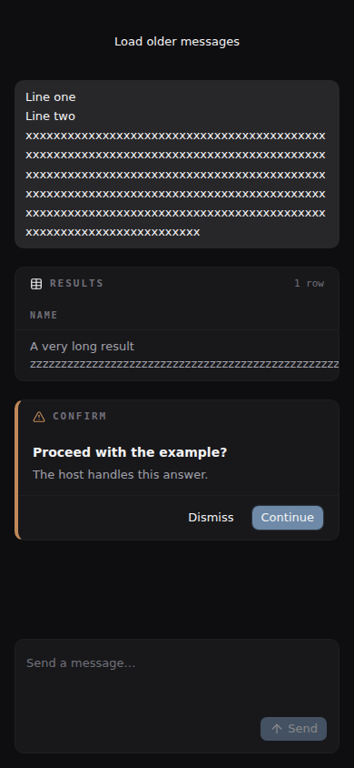

# Chat polish and ops-chat dogfood

CW-20261001-0502, checked 2026-10-01. This builds on the consumer typography
repair in PR 17 / CW-20260913-0032. Changes stay in `packages/kit-chat`.

The gap list was recorded in Torque before implementation, after reading Flux's
composer/toolbar/transcript and ops-chat's `ChatView` and chat hook directly.
Flux supplies the interaction reference; its editor, stores and transport remain
application concerns.

| Gap against Flux | Result in this change |
| --- | --- |
| Composer had no visible submit action or pending feedback | Framed textarea, Send action, editable busy draft, optional host-owned Stop callback; toolbar slots preserved and built-in action can be hidden |
| IME, suggestion focus and ARIA needed protection | Composition Enter does not submit/select; Shift+Enter remains a newline; pointer selection preserves focus; ARIA targets use cmdk's generated IDs; unmatched queries show empty feedback |
| Transcript lacked a bounded reading column and plaintext wrapping | `max-w-3xl` content column, multiline plaintext preserved, long tokens wrap; rendered Markdown controls its own formatting |
| Blank first-token row and weak streaming distinction | Responding indicator before any text, stalled waiting message, error alert, reduced-motion spinner fallback |
| History had no loading presentation | Initial loading suppresses empty state; older-history callback, loading and retry presentation are optional props |
| Cards needed narrow-layout and focus checks | Full-width/min-width-zero chassis, long body text wraps, wide table overflow stays within its own scroll container; existing response and resolved-state semantics retained |

## Consumer evidence

The dogfood consumer was a clean `git archive` of ops-chat at
`ff6affb094d515a4803bf826167943815cbfeb7b`. Its existing `App`, `ChatView`, API
client and EventSource hook were built with a tarball from `npm pack` of this
candidate. Its registry sibling packages stayed at 0.1.0. The live checkout was
read-only throughout.

Chromium ran the production bundle at 1280 × 900. All `/api/**` requests were
intercepted with synthetic session/history/turn/SSE responses. No actual Nanite
turns were sent. Assertions checked:

- Blank Send disabled; clicking Send submitted trimmed content through the
  existing ops-chat handler.
- An empty first-token reply showed Responding; after the host stall timer it
  showed Waiting for the response to continue.
- A draft could be typed while busy. Enter did not send another turn, and that
  draft survived successful completion.
- SSE delta/completion rendered the persisted response; SSE error rendered an
  alert. Two intentional mocked turns were recorded, with no browser page errors.
- Composer text computed to 13px and its frame radius to 10px. Optimistic plain
  text computed to `white-space: pre-wrap` and `overflow-wrap: anywhere`.
  Document scroll width stayed at 1280px.

A separate consumer fixture used the same candidate and styles at 390 × 844,
with a long plaintext turn, a wide sortable table, an answerable confirmation
card, suggestion triggers and older-history callbacks. It exercised kit surfaces
that ops-chat's current hook does not render. Assertions checked:

- Document scroll width stayed at 390px; composer text stayed at 13px.
- A card action could receive keyboard focus, call its host responder, and
  render the submitted state with no second action available.
- Suggestion `aria-controls` resolved to a listbox and `aria-activedescendant`
  resolved to the highlighted option. ArrowDown/Enter selected the next entry;
  Shift+Enter inserted a newline. Pointer selection kept textarea focus.
- Unmatched suggestions showed No matches; Escape dismissed them. The mobile
  Send action worked. Older-history action called the host and showed loading.
- No browser page errors occurred. The wide table remained locally scrollable
  instead of widening the conversation or forcing its header into single letters.

Browser receipts are retained beside this document in
`receipts/ops-browser.json` and `receipts/narrow-browser.json`. These are
observations of this candidate, not tests asserting mutable file content.

### Short-stream jump control

The orchestrator flagged Jump to latest overlapping the last assistant bubble
in PR 13's theme screenshots. Reading the headless scroller's shipped source
confirmed that its button stays mounted with `data-active="false"` and `inert`
when there is nothing to jump to. ChatStream supplied positioning but no inactive
visibility rule, so this was a kit defect, not a demo-container issue.

ChatStream now hides that inactive state. A production consumer fixture with
two messages in a 256px container (including “All packages share the same
palette.”) verified zero overflow and computed `display: none` for the jump
control. A 40-message fixture verified the control hidden at the end, visible
after a user scroll up, and hidden again after clicking it reached the end.
The receipt is `receipts/jump-browser.json`.

## Repeating the check

1. Set `TMPDIR` and `GOTMPDIR` to a disk-backed scratch directory, build the
   workspace, and run `npm pack -w @hollis-labs/kit-chat --pack-destination <scratch>`.
2. Archive the ops-chat commit above into a separate directory; run `npm ci`,
   install the candidate tarball, then run `npm run build`.
3. Serve `dist` statically. In a browser harness, intercept every `/api/**`
   request: return one session, Markdown history, and a turn response whose
   `stream_url` points at an intercepted SSE endpoint. Hold that endpoint open
   to inspect pending/stalled states, then supply `delta` and `stream_end`
   events. A second turn with an `error` event exercises the error alert.
4. Render a separate fixture with `ChatStream`, `ChatInput`, `TableCard` and
   `ConfirmationCard` to check suggestions, history presentation, card responses
   and narrow overflow. Keep generated bundles outside Tailwind's source tree.

## Verification and boundaries

The workspace gate is `npm run typecheck && npm run lint && npm run test:run &&
npm run build`; `node .github/scripts/design-rules-gate.mjs` checks token rules.
The kit has 83 passing tests, including nine added interaction/state cases.
All gate commands use the disk-backed temporary directory.

CW-20260930-0017 remains responsible for windowed history: this change adds no
fetching, cursor management or automatic pagination. Ops-chat does not yet pass
initial-loading/history props or a cancellation callback; those opt-in surfaces
were checked in the fixture/unit tests rather than claimed as adopted in the app.
The narrow fixture verifies the kit, not ops-chat's fixed-width session sidebar.
No app files, package versions or shared primitives changed. Local kit-chat `cn`
remains until design-components 0.1.1 publishes the shared fix (CW-20261001-0521).
